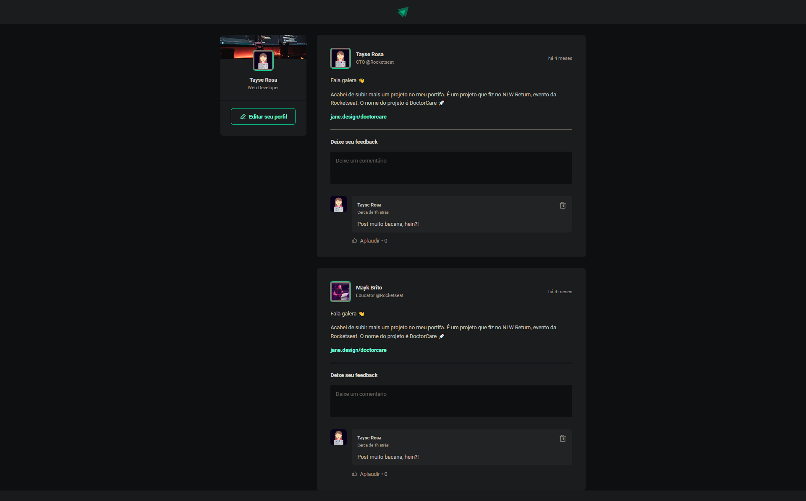

# Projeto Ignite - Fundamentos React JS

Desenvolvimento de uma página para conhecimentos das seguintes áreas:

- vite
- css modules
- componentes
- stytled-componentes
- typescript
- Dentre muitos outros conhecimentos...

## Demonstração

Demonstração do projeto:

## 🚀 Sobre mim
Eu sou uma pessoa desenvolvedora full-stack...

## 🔗 Links

